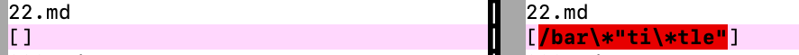
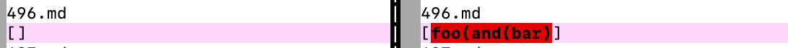

## Lab Report 5

# Explanations:

* How you found the tests with different results (Did you use vimdiff on the results of running a bash for loop? Did you search through manually? Did you use some other programmatic idea?)
    
    **To find the tests with different results, I used `vimdiff` after running a bash for loop and putting the results in a .txt file. This made the search much more autonomous and easy.** 

* Provide a link to the test-file with different-results (in the provided repository or your repository , either is fine)

    **In the screenshots below, the left side is the provided implementation while the right side is my group's implementation.**
    
    [Test 22](https://github.com/nidhidhamnani/markdown-parser/blob/main/test-files/22.md)

    

    I don't believe that either implementation produces the correct output. I think the correct output would be **/bar\***. This is the link shown in VSCode. I think the bug in my group's implementation is the oversight of a title. The implementation should include a part in the code that ensures there are no quotation marks indicating a title. Adding a method that checks for quotation marks should fix this issue. 

    [Test 496](https://github.com/nidhidhamnani/markdown-parser/blob/main/test-files/496.md)

    

    I believe that the provided implementation had the correct output, with no links. When I look at the preview of this file in VSCode, there is no link shown.

* 
