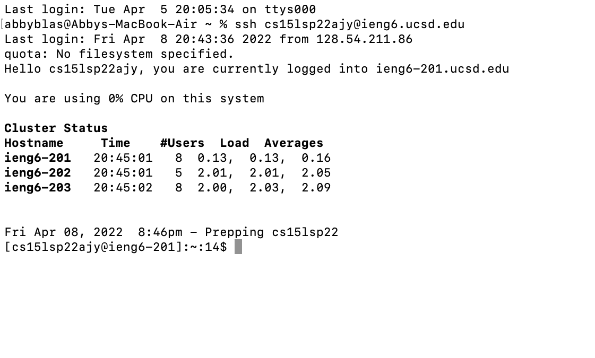
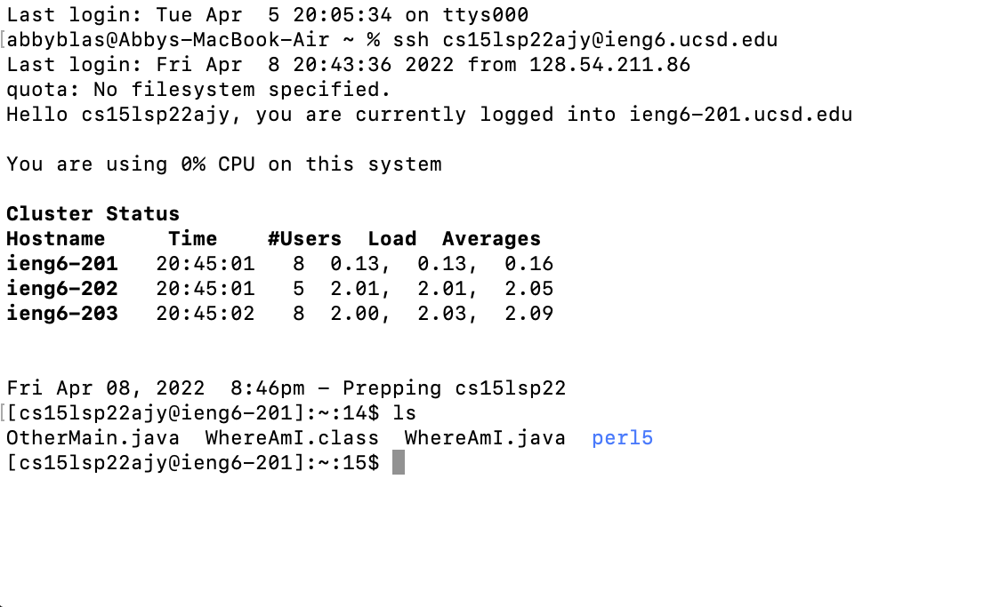
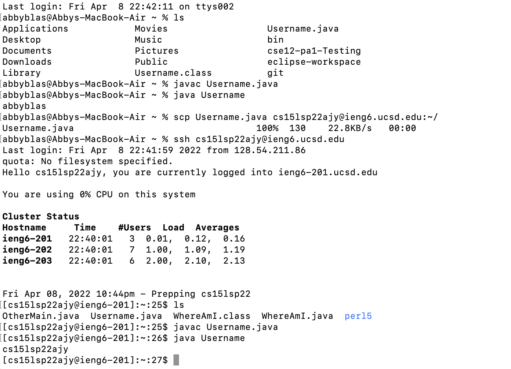
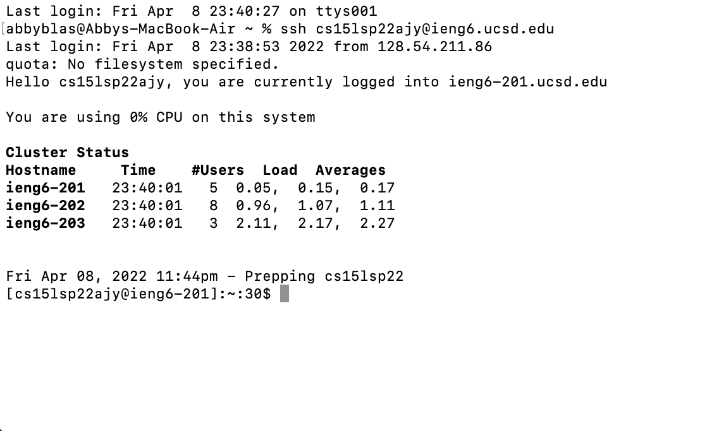
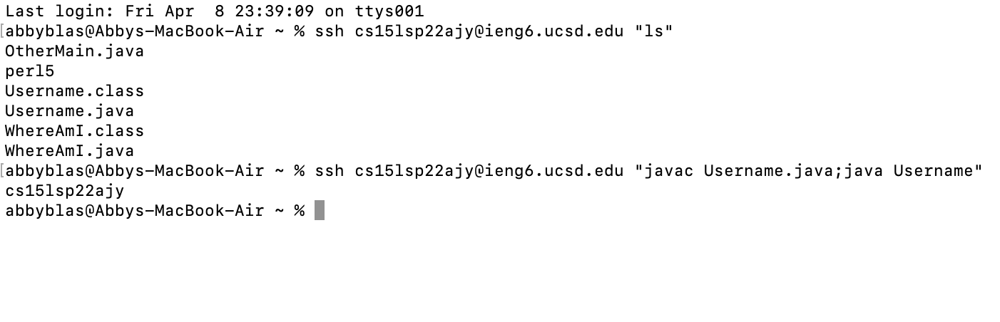

# Lab Report 1 Week 2

Follow the instructions below to connect to a remote server.

## Installing Visual Studio Code

Go to [Visual Studio Code](https://code.visualstudio.com/) and install the IDE to begin logging in to a course specific account on ```ieng6```.


After installing VSCode, you can open the installation and it should automatically prompt you to begin coding.


## Remotely Connecting

You will be able to find your course-specific account for CSE 15L [here](https://sdacs.ucsd.edu/~icc/index.php). The username for your account will begin with "cs15l", be followed by the quarter and year you are taking CSE 15L in, and end in three characters that are specific to you. This is what my page looks like:


My username is **cs15lsp22ajy**. Your own course username will allow you to begin connecting remotely. Next, you should open a terminal in VSCode (a shortcut for this would be Ctrl + `) and type the following command. You should use your own username.

```$ ssh cs15lsp22ajy@ieng6.ucsd.edu```

You will be asked:

```
Are you sure you want to continue connecting

(yes/no/[fingerprint])
```


Type ```yes``` and press enter to contiue setting up your SSH connection.

At this point, you should be prompted to enter your password. Once you do, you are remotely connected!

## Trying Some Commands

Your terminal should look something like this:





At this point, you can start testing out command that will be useful to know. Good commands to start with would be ```cd```, ```ls```, ```pwd```, ```mkdir```, and ```cp```.

Testing out a command will look like this:




As you can tell from the image above, the ```ls``` command will produce a list of files in the directory that you are currently in.

## Moving files with ```scp```

An important thing to note when setting up your ssh connection is that you are connecting to a computer that is outside your own. In our case, this is a computer in the CSE basement. When setting up a connection with a computer outside your own, your computer is refered to as the *client* and the outside computer as the *server*. When using a client and server, we use the ```scp``` command on the *client* terminal to transfer files between the accounts.

We can test this by creating a file on your computer called ```Username.java```

Paste this into the file you created:

```
class Username {
  public static void main(String[] args) {
    System.out.println(System.getProperty("user.name"));
  }
}
```

Once the file is saved, you can run it from your terminal to see what it outputs. do this by typing the following commands:

```$ javac Username.java```

```$ java Username```

You will see that the code displays the client username. After this, type the following ```scp``` command and log into your server account.

```$ scp Username.java cs15lsp22ajy@ucsd.edu:~/```

At this point, you should be able to log into the server account and use the ```ls``` command to see that ```Username.java``` is now in the directory. You can then run the previous ```javac``` and ```java``` commands to see that it now outputs the servers username instead. If you completed all of these steps right, your terminal shoud look somewhat like this:



## Setting an SSH Key



In the photo above, you can see that I did not need to type my password to use the ```ssh``` command. This makes moving files and logging onto the server much quicker and easier. You can start this process by entering the following code into your client terminal:

```$ ssh-keygen```

After the next prompt type the following (replace ```abbyblas``` with your own username):

```$ /Users/abbyblas/.ssh/id_rsa```
When the terminal prompts you to enter a password, just press enter. Repeat this when it asks for the password again. Next, log into your server account and enter the following command:

```$ mkdir .ssh```

You can use the ```exit``` command to logout and reenter the client terminal. In the client terminal, type the following (replacing my usernames with your own):

```$ scp /Users/abbyblas/.ssh/id_rsa.pub cs15lsp22ajy@ieng6.ucsd.edu:~/.ssh/authorized_keys```

This should allow you to use ```ssh``` and ```scp``` commands without needing your password.


## Optimize Remote Running

Running ```ssh``` and ```scp``` commands is way more pleasant without the need of a password. There are two other ways of making running commands even better:
* You can run commands without needing to log into the server at all. This is done using quotation marks (```""```).
* You can run several commands in one line by using a semicolon (```;```) between the commands.

