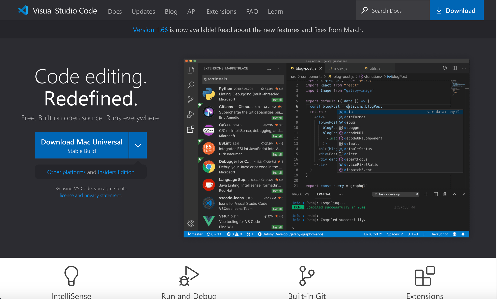
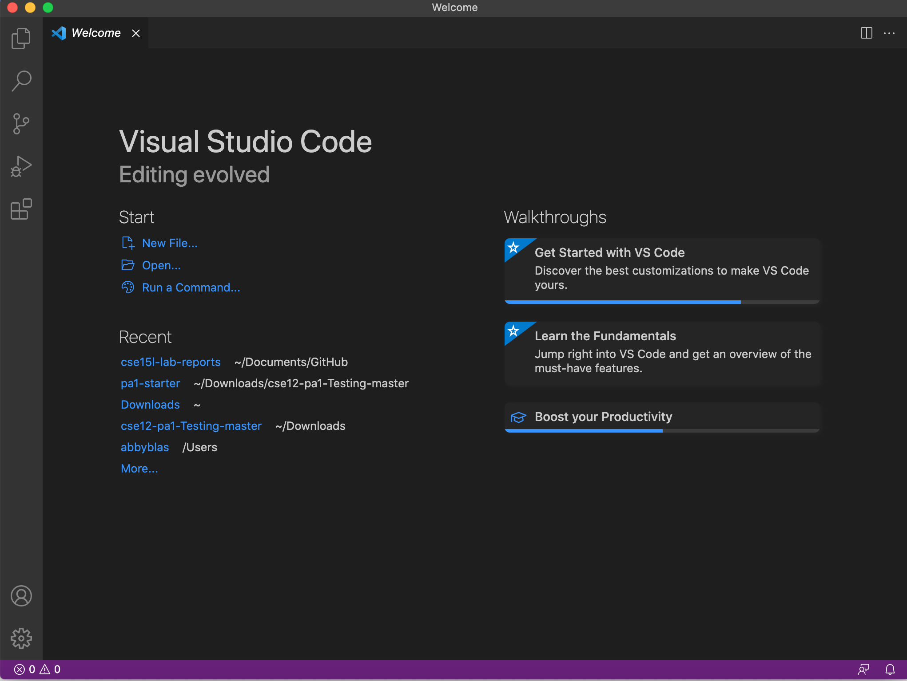
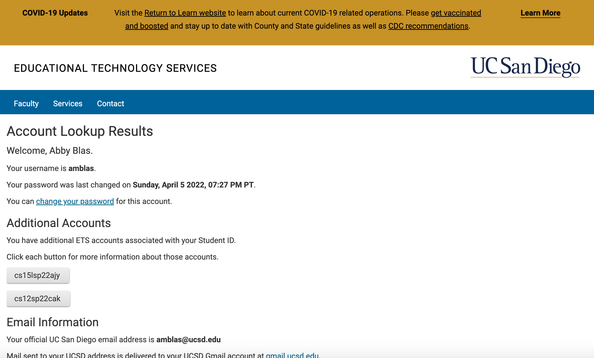

# Lab Report 1 Week 2


## Installing Visual Studio Code

Go to [Visual Studio Code](https://code.visualstudio.com/) and install the IDE to begin logging in to a course specific account on ```ieng6```.





After installing VSCode, you can open the installation and it should automatically prompt you to begin coding.





## Remotely Connecting

You will be able to find your course-specific account for CSE 15L [here](https://sdacs.ucsd.edu/~icc/index.php). The username for your SSH account will begin with "cs15l", be followed by the quarter and year you are taking CSE 15L in, and end in three characters that are specific to you. This is what my page looks like:





My username is **cs15lsp22ajy**. Your course username will allow you to begin connecting remotely. Next, you should open a terminal in VSCode (a shortcut for this would be Ctrl + `) and type the following command. You should use your own username.

```$ ssh cs15lsp22ajy@ieng6.ucsd.edu```

You will be asked:

```Are you sure you want to continue connecting ```

```(yes/no/[fingerprint])```

type ```yes``` and press enter to contiue setting up your SSH connection.

At this point, you should be prompted to enter your password. Once you do, you are now remotely connected!

## Trying Some Commands

## Moving files with ```scp```

## Setting an SSH Key

## Optimize Remote Running
