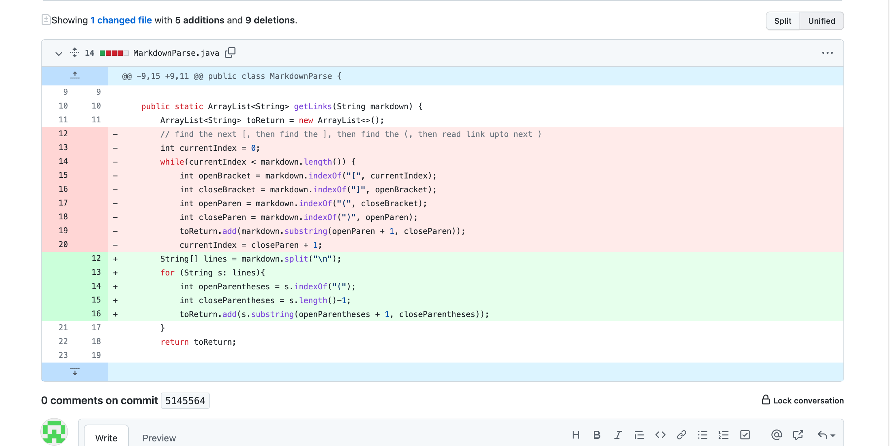
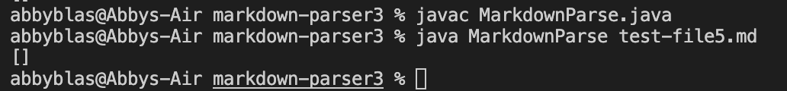
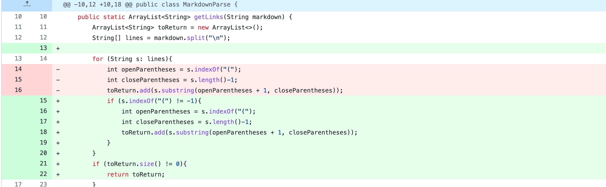
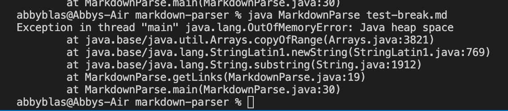
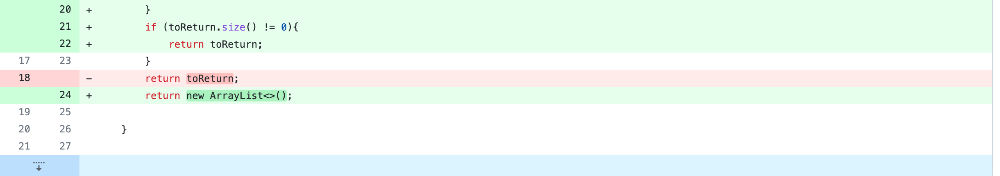
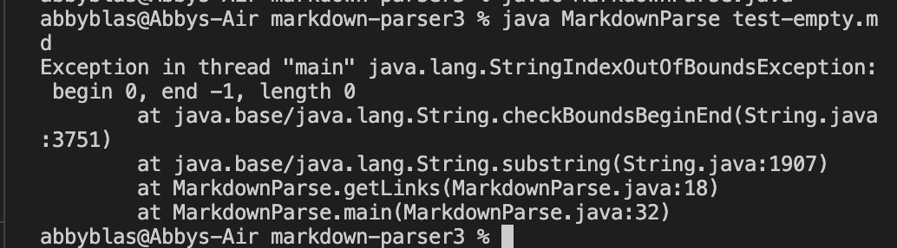

# Lab Report 2 Week 4
## Change 1

Test [file](test-file5.md)

We made this change because the code did not account for if the links were on the same line. This ended up with the symptom of an empty array being returned.

## Change 2

Test [file](test-break.md)

We made this change in order to account for if the link had other parentheses within it. The test file had a link with several pairs of parentheses, which caused a symptom in the previous code. This was fixed by the change we made.

## Change 3

Test [file](test-empty.md)

We made this change because the changes we made to the code would not account for if the file was empty. This was not a bug in the original code, but we needed to add this part to our code to ensure that it would not be a new bug.