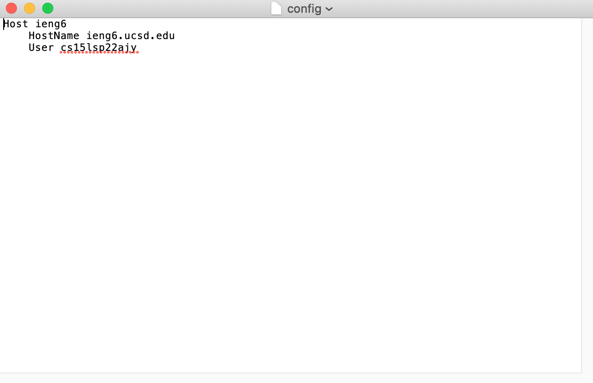
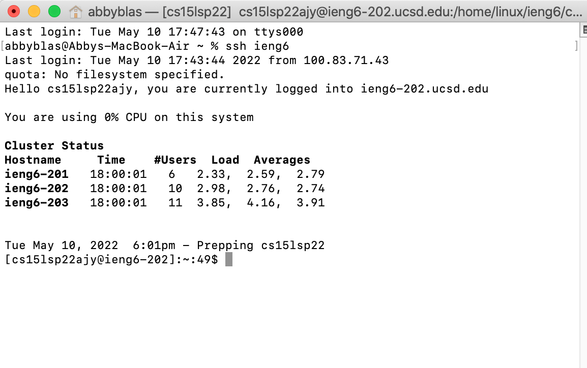
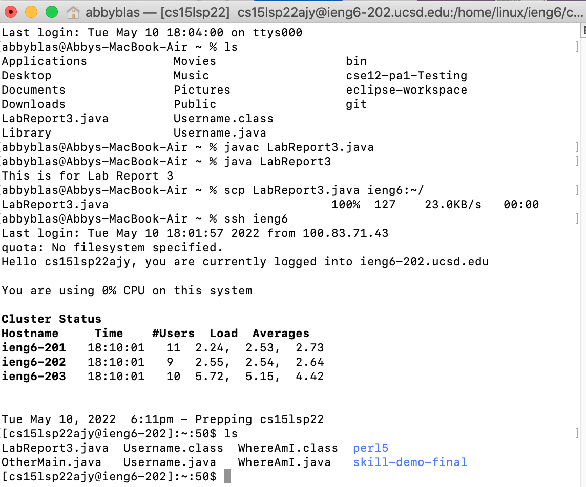
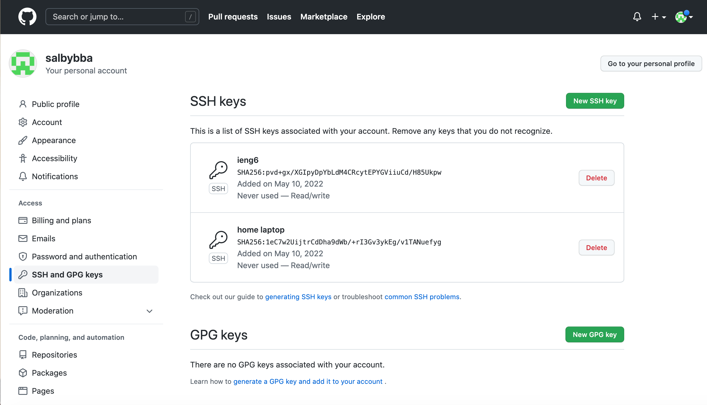
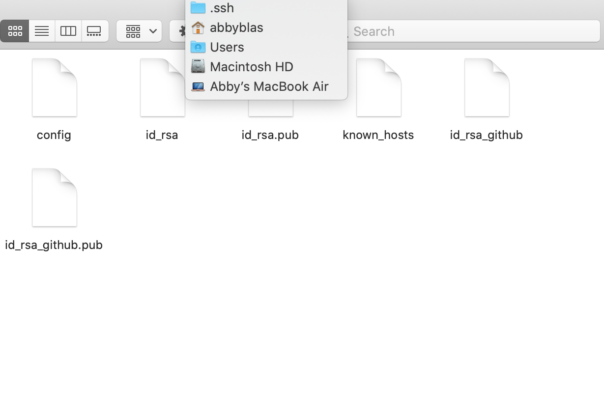

## Lab Report 3

# Streamlining ssh Configuration

Additions made to the ```.ssh/config``` file:


Using the streamlined ```ssh``` command to log into my account:


Using ```scp```:


# Setup Github Access from ieng6

Stored public key in Github:


Stored private key on my user account:


# Copying whole directories with ```scp -r```