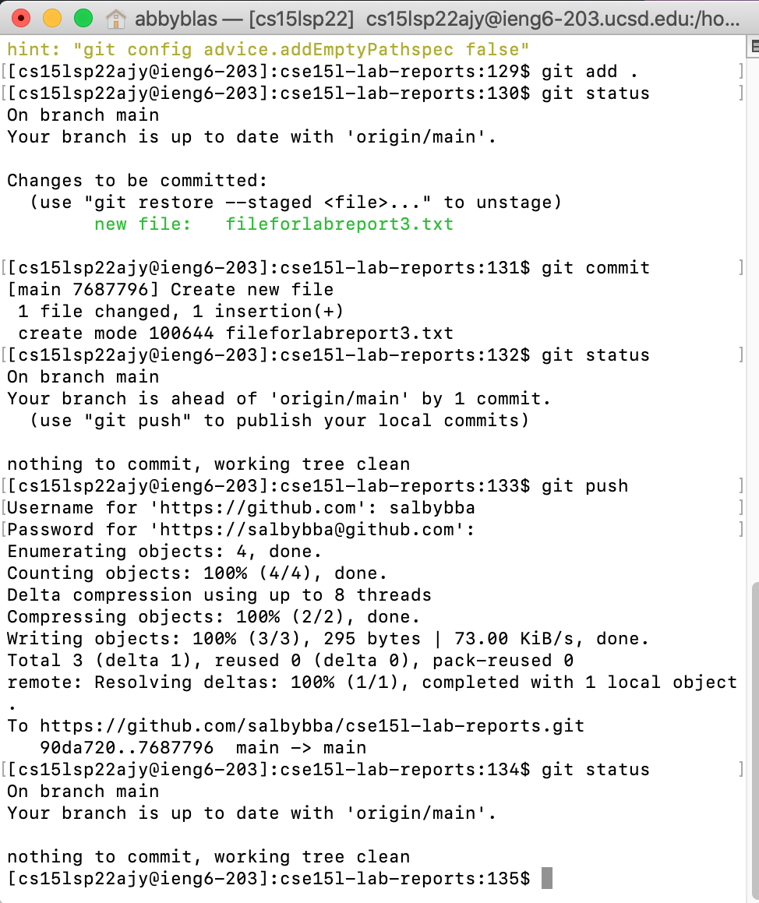
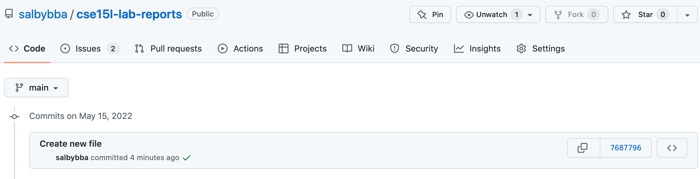
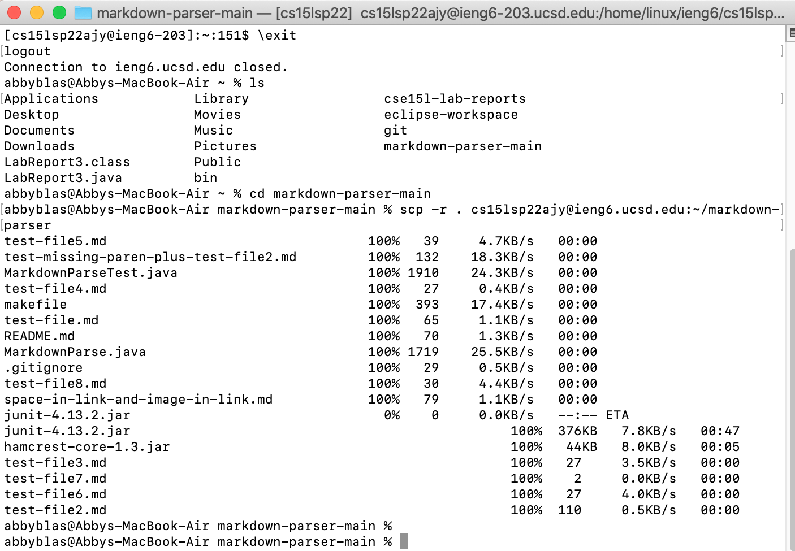

## Lab Report 3

# Streamlining ssh Configuration

Additions made to the ```.ssh/config``` file:


Using the streamlined ```ssh``` command to log into my account:


Using ```scp```:


# Setup Github Access from ieng6

Stored public key in Github:


Stored private key on my user account:


Using git commands on ieng6 account:


Commit to GitHub:


[Link](https://github.com/salbybba/cse15l-lab-reports/commit/7687796a895bdfc76de8232a555e2c1340e8a69d) to commit in GitHub.


# Copying whole directories with ```scp -r```

Using ```scp -r``` to copy markdown-parser to my ieng6 account:



