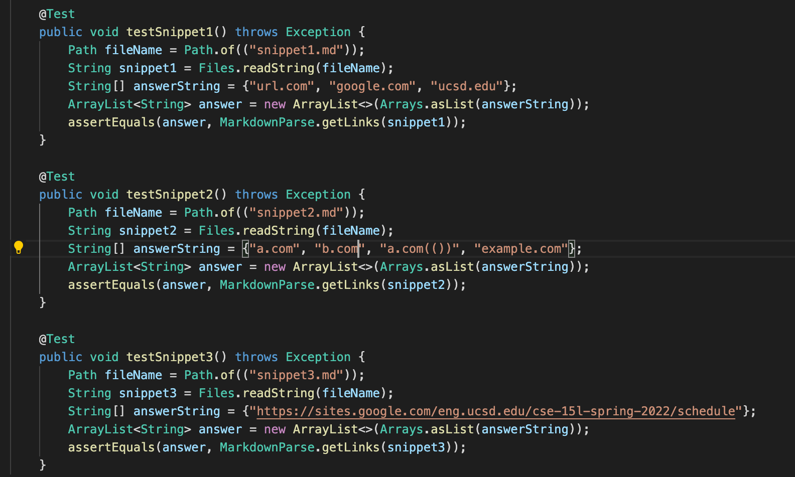
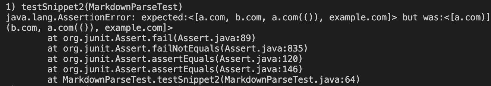
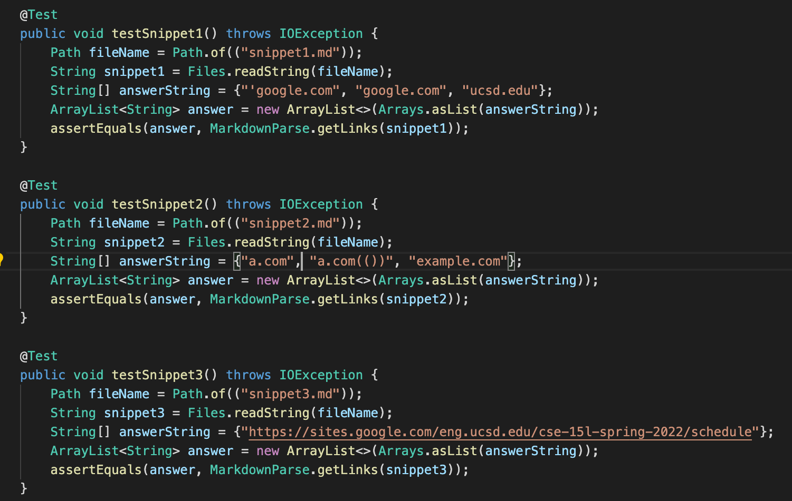
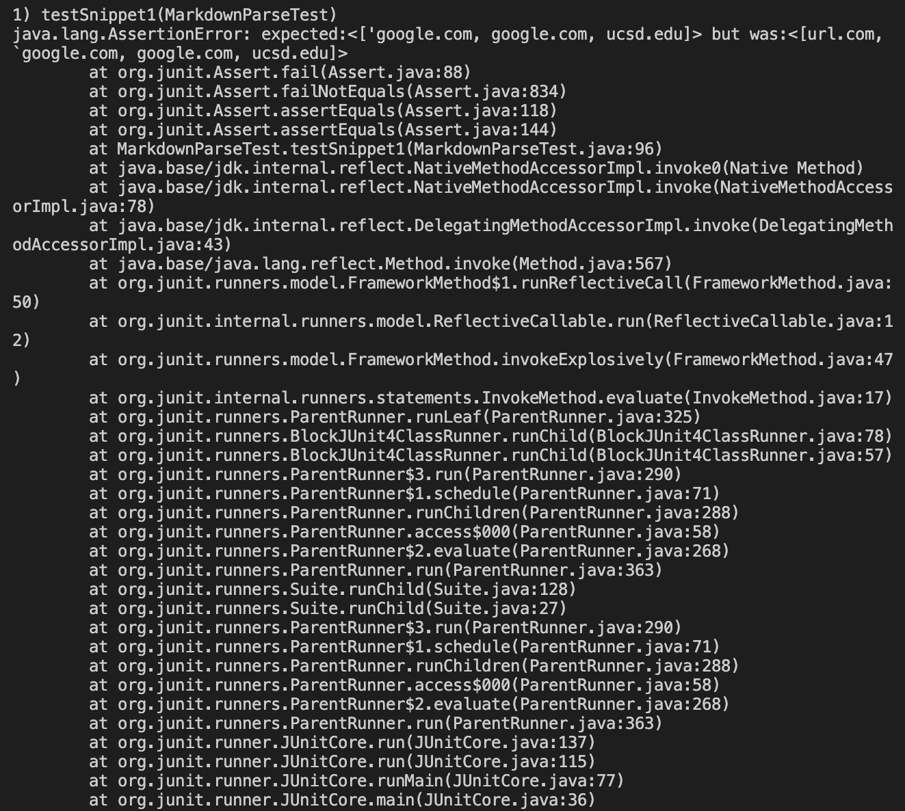
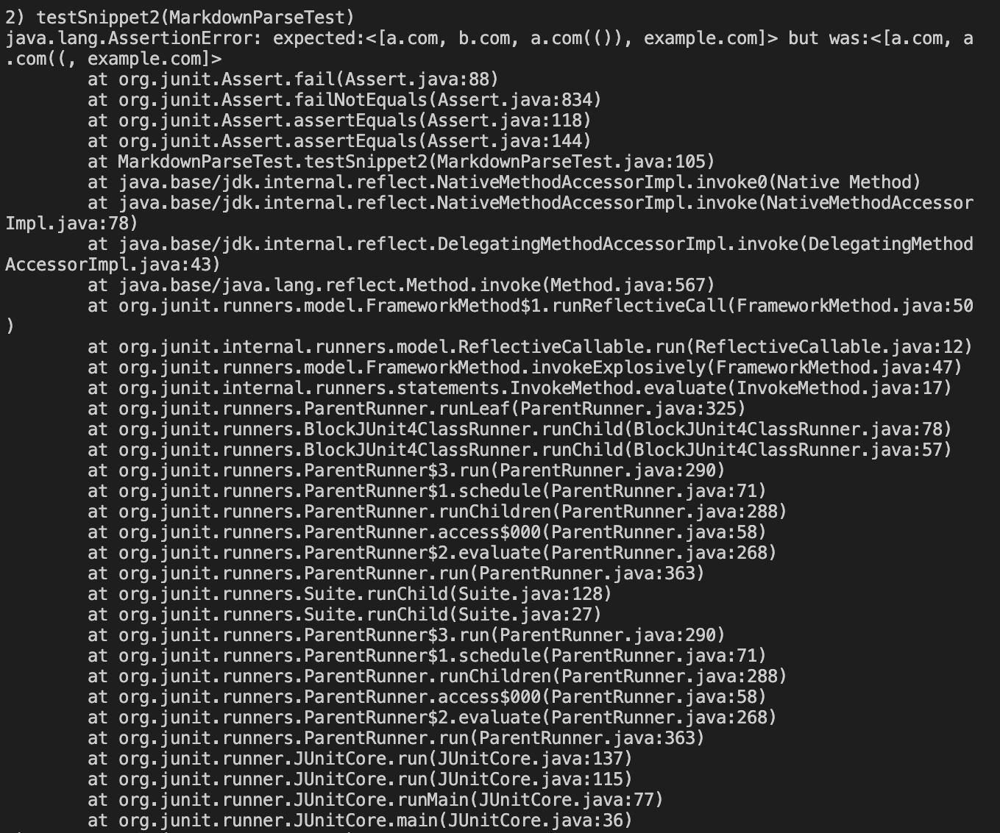

# Lab Report 4

## My group's markdown [repository.](https://github.com/DanUCSD/markdown-parser)

The tests I created for each snippet:

The test that I created for snippet 1 passed, but the tests for snippet 2 and snippet 3 did not. 

JUnit output that shows the test for snippet 2 failing:

JUnit output that shows the test for snippet 3 failing:

## [Repository](https://github.com/YoavGutmanUCSD/markdown-parser-2) reviewed in week 7.

The tests I created for each snippet:

All of the tests I created failed.

JUnit output that shows the test for snippet 1 failing:

JUnit output that shows the test for snippet 2 failing:

JUnit output that shows the test for snippet 3 failing:

