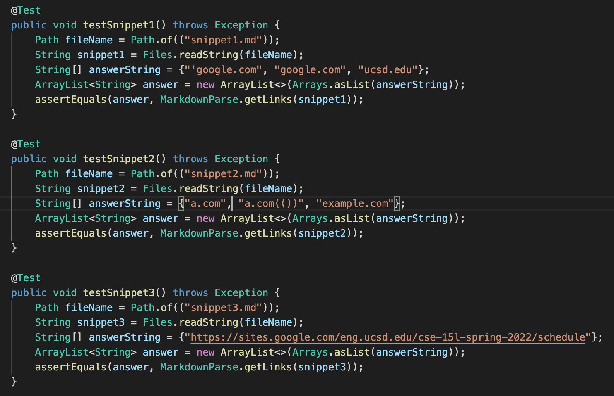
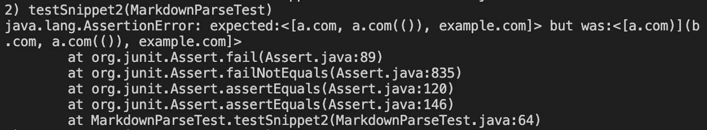
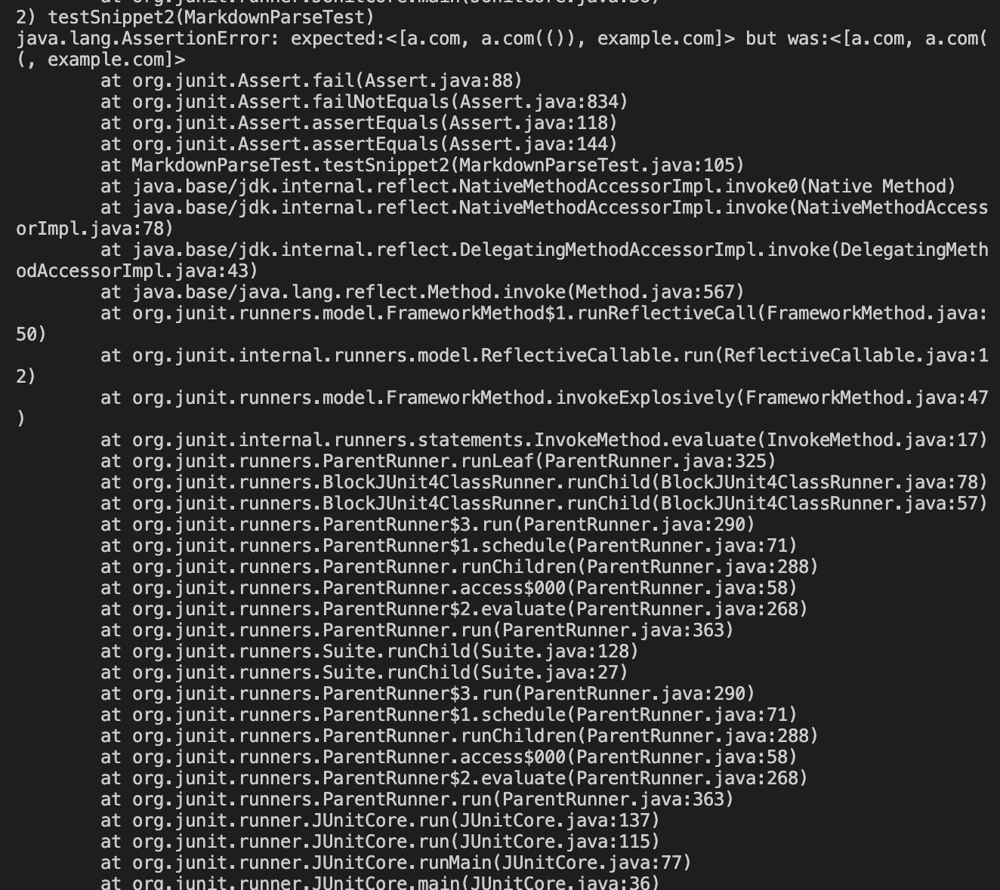

# Lab Report 4

## My group's markdown [repository.](https://github.com/DanUCSD/markdown-parser)

**The tests I created for each snippet:**

**Results of `testSnippet1()`**

JUnit output that shows `testSnippet2()` failing:

I think this would be an easy problem to fix because I think the problem just has to do with identifying the backticks in the markdown file. Since the link to url.com wasn't hyperlinked in the VSCode Preview, then it should not be in the returned array. A simple method to identify where the backticks are should fix the issue.

**Results of `testSnippet2()`**

JUnit output that shows `testSnippet2()` failing:

To fix this issue I could add a method that counts the `[`, `]`, `(`, and `)` into my code. This would maybe be a longer implementation, but we have seen a similar method in the version of `markdown-parser` that we use in week 8's lab.

**Results of `testSnippet3()`**

JUnit output that shows `testSnippet3()` failing:

I think this fix would be more involved. We did not account for having a link on a different line, and this essentially breaks our implementation of `markdown-parser`. This is because we read each line separately by putting them into different indeces in an Array.

**My code did not work for any test.**

## [Repository](https://github.com/YoavGutmanUCSD/markdown-parser-2) reviewed in week 7.

**The tests I created for each snippet:**

**Results of `testSnippet1()`**

JUnit output that shows `testSnippet1()` failing:

I think this would be an easy problem to fix because I think the problem just has to do with identifying the backticks in the markdown file. Since the link to url.com wasn't hyperlinked in the VSCode Preview, then it should not be in the returned array. A simple method to identify where the backticks are should fix the issue.

**Results of `testSnippet2()`**

JUnit output that shows `testSnippet2()` failing:

To fix this issue I could add a method that counts the `[`, `]`, `(`, and `)` into my code. This would maybe be a longer implementation, but we have seen a similar method in the version of `markdown-parser` that we use in week 8's lab.

**Results of `testSnippet3()`**

JUnit output that shows `testSnippet3()` failing:

I think this fix would be more involved. We did not account for having a link on a different line, and this essentially breaks our implementation of `markdown-parser`. This is because we read each line separately by putting them into different indeces in an Array.